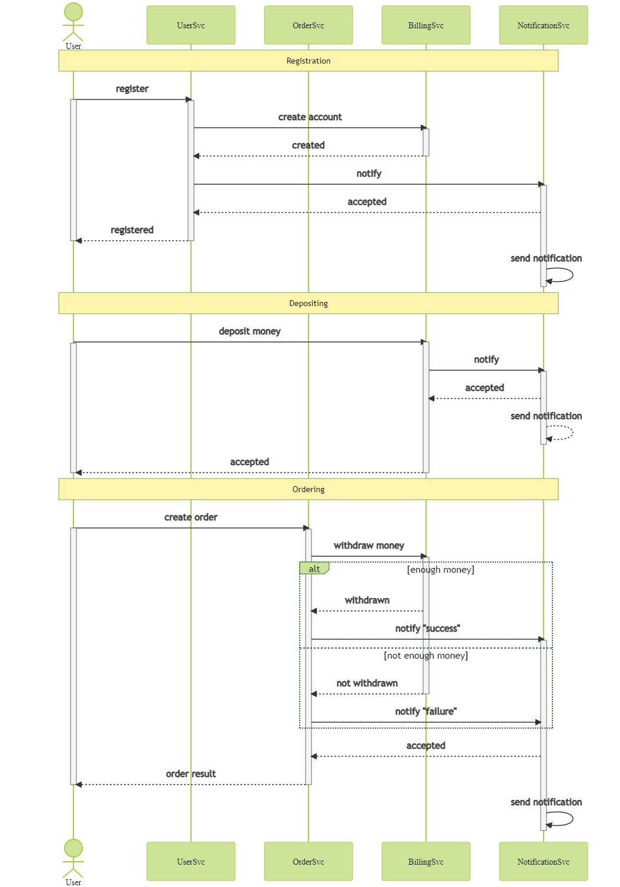
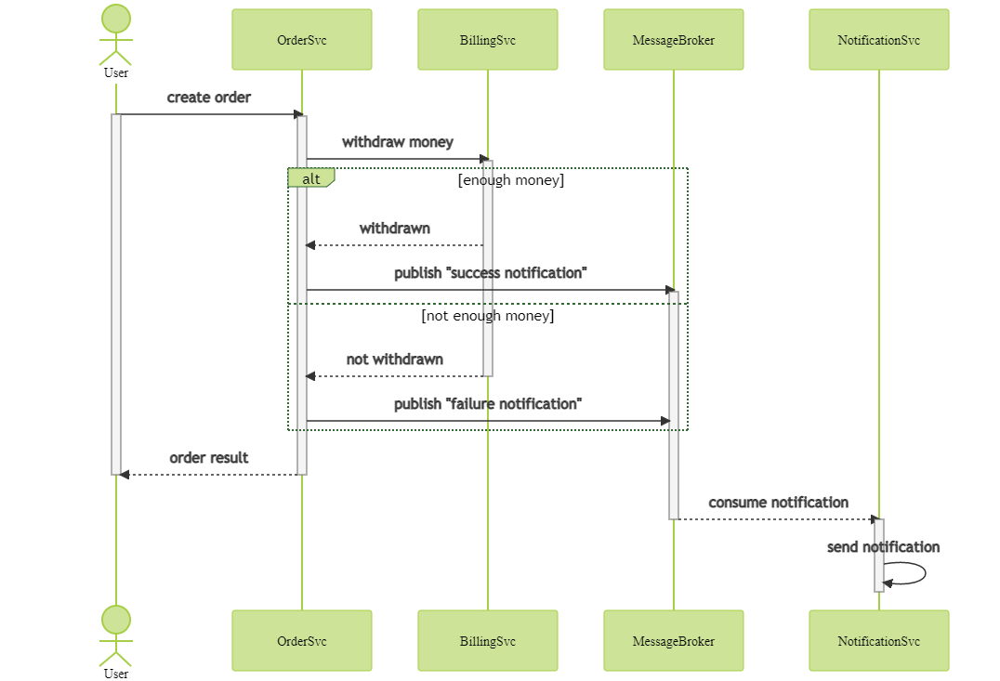
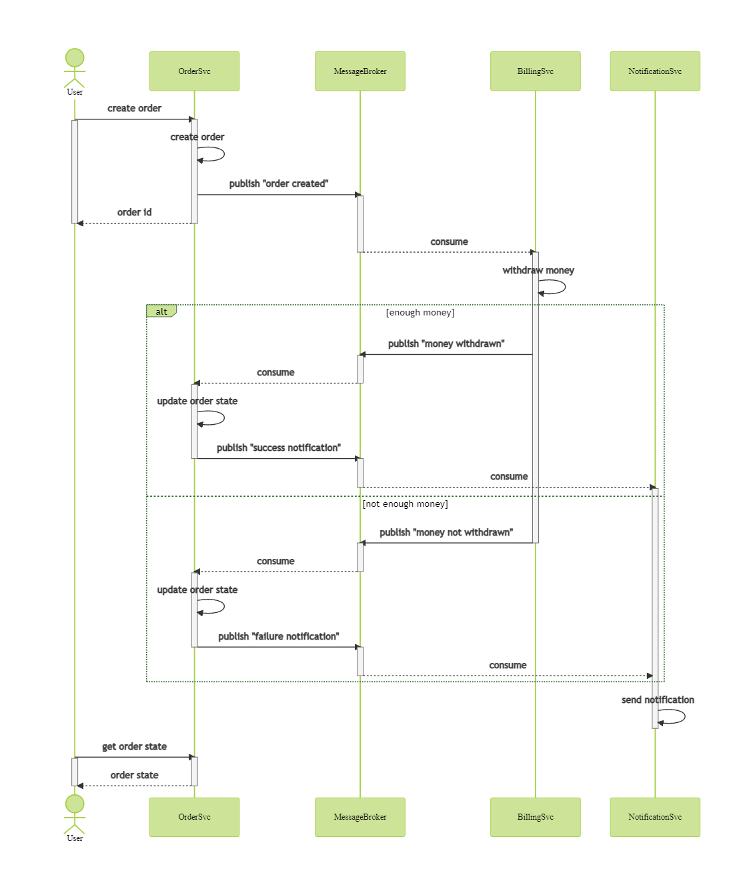

# Проектирование

## Сценарии

В решении рассматриваются следующие сценарии:

- Регистрация -- пользователь регистрируется в системе, вместе с этим создается его платежный аккаунт.
- Пополнение счета -- пользователь вносит деньги на свой платежный аккаунт.
- Оформление заказа -- пользователь создает заказ, сначала снимаются деньги с платежного аккаунта, затем отправляется уведомление с результатом; рассматривается 2 варианта поведения, когда платеж подтвержден или отклонен.

## Сервисы

В решении рассматриваются следующие сервисы:

- User Service (UserSvc) -- сервис пользователей; хранит данные пользователей, предоставляет функционал регистрации и аутентификации.
- Order Service (OrderSvc) -- сервис заказов; хранит и обрабатывает заказы, предоставляет функционал по оформлению заказа и получения его статуса.
- Billing Service (BillingSvc) -- сервис биллинга; хранит платежные аккаунты пользователей, предоставляет фукнционал по пополнению и снятию денег со счета.
- Notification Service (NotificationSvc) -- сервис уведомлений; отправляет и хранит уведомления.
- Message Broker (MessageBroker) -- брокер сообщений; использутеся при событийных вариантах взаимодействия сервисов.

## Интерфейсы

API сервисов представлены в формате OpenAPI v3 (посмотреть можно с помощью [swagger editor](https://editor.swagger.io/) ):

- [User Service](apis/user_service.yaml)
- [Order Service](apis/order_service.yaml)
- [Billing Service](apis/billing_service.yaml)

## Варианты взаимодействия

Для реализации сценариев рассматриваются следующие варианты взаимодействия сервисов:

- Только HTTP взаимодействие
- Событийное взаимодействие с использование брокера сообщений для уведомлений
- Event Collaboration cтиль взаимодействия с использованием брокера сообщений

Ниже для каждого варианта рассмотрены sequence диаграммы.
Предпочтительным в рамках текущего задания рассматривается 2й вариант: событийное взаимодейтвие для уведомлений.

### HTTP взаимодействие

### Событийное взаимодействие для уведомлений

### Event Collaboration

