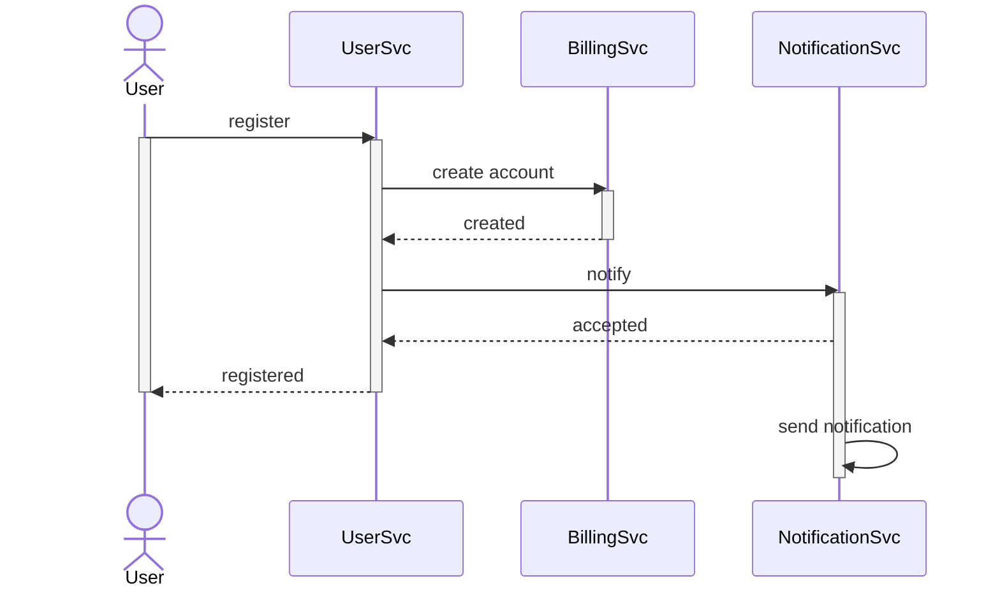
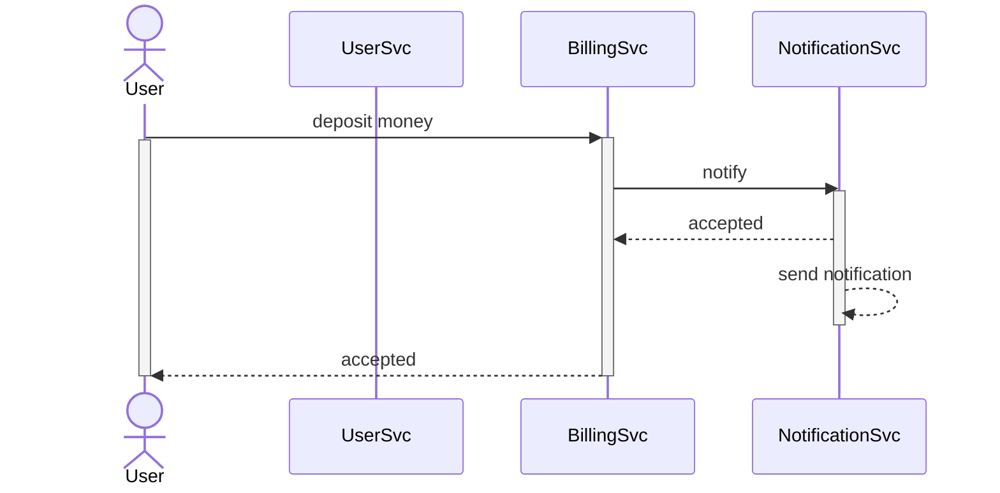
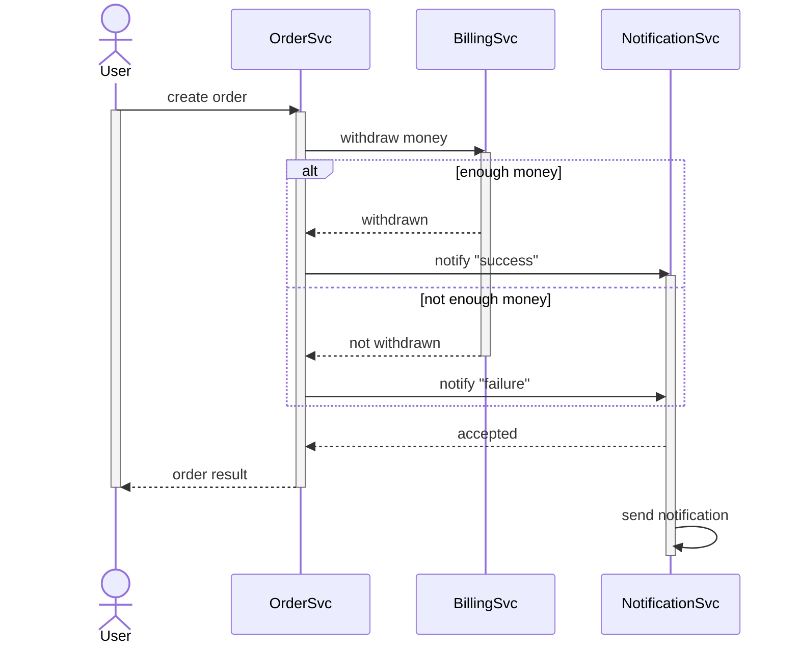
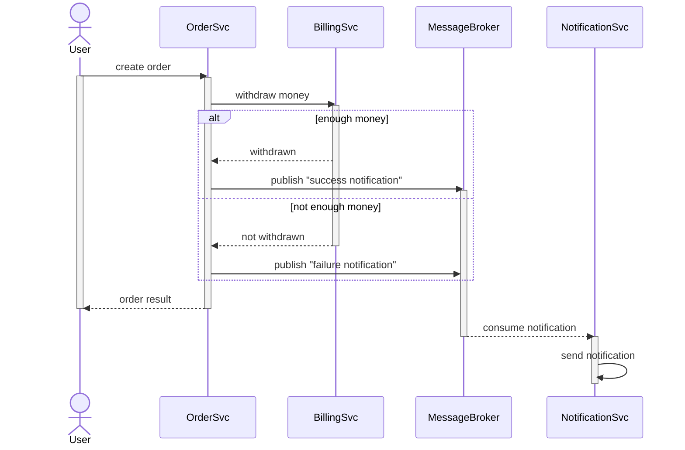
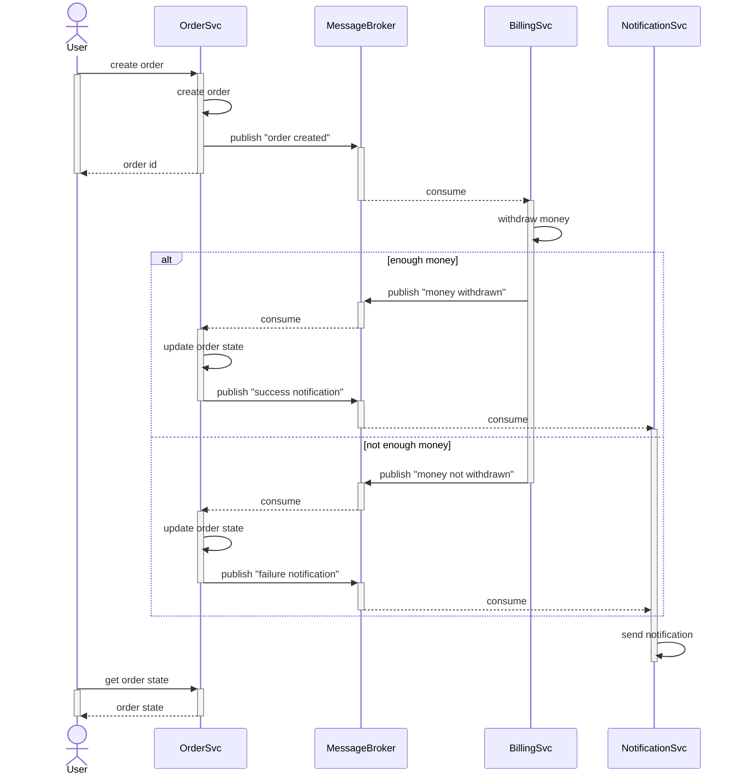

# Services interaction

## Sync. Http only

### Registration

```mermaid
sequenceDiagram
actor User
participant UserSvc
participant BillingSvc
participant NotificationSvc

User ->> UserSvc: register
activate User
activate UserSvc
UserSvc ->> BillingSvc: create account
activate BillingSvc
BillingSvc -->> UserSvc: created
deactivate BillingSvc
UserSvc ->> NotificationSvc: notify
activate NotificationSvc
NotificationSvc -->> UserSvc: accepted
UserSvc -->> User: registered
deactivate UserSvc
deactivate User
#NotificationSvc ->> NotificationSvc: send email
NotificationSvc ->> NotificationSvc: send notification
deactivate NotificationSvc
```

### Depositing

```mermaid
sequenceDiagram
actor User
participant UserSvc
participant BillingSvc
participant NotificationSvc

User ->>+ BillingSvc: deposit money
activate User
BillingSvc ->> NotificationSvc: notify
activate NotificationSvc
NotificationSvc -->> BillingSvc: accepted
NotificationSvc -->> NotificationSvc: send notification
deactivate NotificationSvc
BillingSvc -->>- User: accepted
deactivate User
```

### Ordering

```mermaid
sequenceDiagram
actor User
participant OrderSvc
participant BillingSvc
participant NotificationSvc

User ->> OrderSvc: create order
activate User
activate OrderSvc
OrderSvc ->> BillingSvc: withdraw money
activate BillingSvc
alt enough money
    BillingSvc -->> OrderSvc: withdrawn
    OrderSvc ->> NotificationSvc: notify "success"
    activate NotificationSvc
else not enough money
    BillingSvc -->> OrderSvc: not withdrawn
    deactivate BillingSvc
    OrderSvc ->> NotificationSvc: notify "failure"
end
NotificationSvc-->>OrderSvc: accepted
OrderSvc -->> User: order result
deactivate OrderSvc
deactivate User
NotificationSvc ->> NotificationSvc: send notification
deactivate NotificationSvc
```

## Async. Notifications

```mermaid
sequenceDiagram
actor User
participant OrderSvc
participant BillingSvc
participant MessageBroker
participant NotificationSvc

User ->> OrderSvc: create order
activate User
activate OrderSvc
OrderSvc ->> BillingSvc: withdraw money
activate BillingSvc
alt enough money
    BillingSvc -->> OrderSvc: withdrawn
    OrderSvc ->> MessageBroker: publish "success notification"
    activate MessageBroker
else not enough money
    BillingSvc -->> OrderSvc: not withdrawn
    deactivate BillingSvc
    OrderSvc ->> MessageBroker: publish "failure notification"
end
OrderSvc -->> User: order result
deactivate OrderSvc
deactivate User
MessageBroker -->> NotificationSvc: consume notification
deactivate MessageBroker
activate NotificationSvc
NotificationSvc ->> NotificationSvc: send notification
deactivate NotificationSvc
```

## Async. Event Collaboration

```mermaid
sequenceDiagram
actor User
participant OrderSvc
participant MessageBroker
participant BillingSvc
participant NotificationSvc

User ->>+ OrderSvc: create order
activate User
OrderSvc ->> OrderSvc: create order
OrderSvc ->>+ MessageBroker: publish "order created"
OrderSvc -->>- User: order id
deactivate User
MessageBroker -->>- BillingSvc: consume
activate BillingSvc
BillingSvc ->> BillingSvc: withdraw money
alt enough money
    BillingSvc ->>+ MessageBroker: publish "money withdrawn"
    MessageBroker -->>- OrderSvc: consume
    activate OrderSvc
    OrderSvc ->> OrderSvc: update order state
    OrderSvc ->>+ MessageBroker: publish "success notification"
    deactivate OrderSvc
    MessageBroker -->>- NotificationSvc: consume
    activate NotificationSvc
else not enough money
    BillingSvc ->>+ MessageBroker: publish "money not withdrawn"
    deactivate BillingSvc
    MessageBroker -->>- OrderSvc: consume
    activate OrderSvc
    OrderSvc ->> OrderSvc: update order state
    OrderSvc ->>+ MessageBroker: publish "failure notification"
    deactivate OrderSvc
    MessageBroker -->>- NotificationSvc: consume
end
NotificationSvc ->> NotificationSvc: send notification
deactivate NotificationSvc

User ->>+ OrderSvc: get order state
activate User
OrderSvc -->>- User: order state
deactivate User
```
