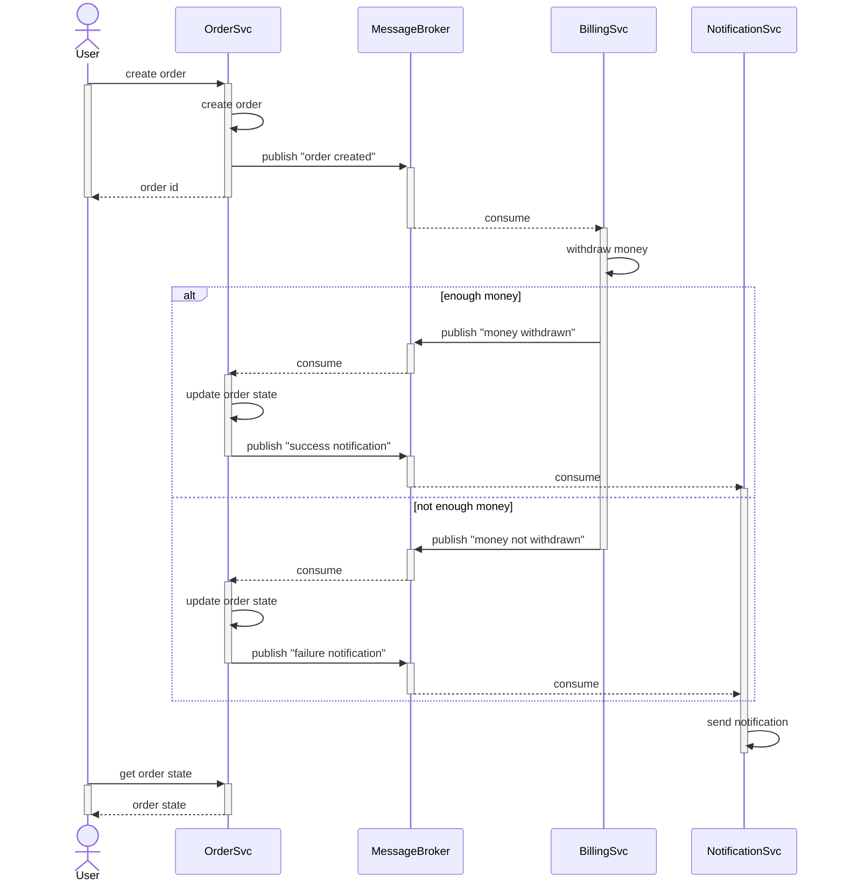

```mermaid
sequenceDiagram
actor User
participant OrderSvc
participant MessageBroker
participant BillingSvc
participant NotificationSvc

User ->>+ OrderSvc: create order
activate User
OrderSvc ->> OrderSvc: create order
OrderSvc ->>+ MessageBroker: publish "order created"
OrderSvc -->>- User: order id
deactivate User
MessageBroker -->>- BillingSvc: consume
activate BillingSvc
BillingSvc ->> BillingSvc: withdraw money
alt enough money
    BillingSvc ->>+ MessageBroker: publish "money withdrawn"
    MessageBroker -->>- OrderSvc: consume
    activate OrderSvc
    OrderSvc ->> OrderSvc: update order state
    OrderSvc ->>+ MessageBroker: publish "success notification"
    deactivate OrderSvc
    MessageBroker -->>- NotificationSvc: consume
    activate NotificationSvc
else not enough money
    BillingSvc ->>+ MessageBroker: publish "money not withdrawn"
    deactivate BillingSvc
    MessageBroker -->>- OrderSvc: consume
    activate OrderSvc
    OrderSvc ->> OrderSvc: update order state
    OrderSvc ->>+ MessageBroker: publish "failure notification"
    deactivate OrderSvc
    MessageBroker -->>- NotificationSvc: consume
end
NotificationSvc ->> NotificationSvc: send notification
deactivate NotificationSvc

User ->>+ OrderSvc: get order state
activate User
OrderSvc -->>- User: order state
deactivate User
```
