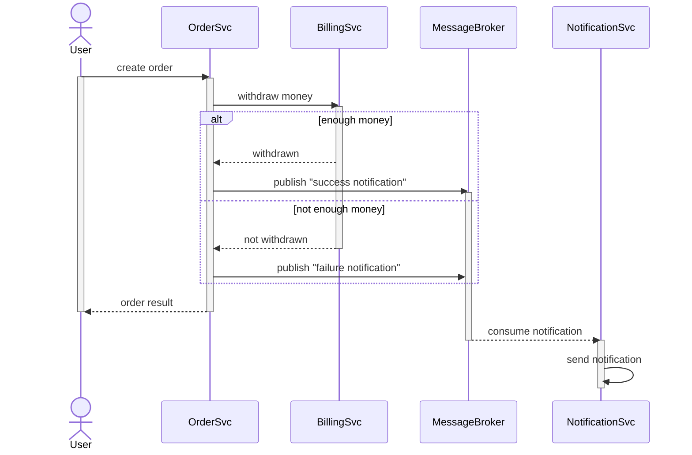

```mermaid
sequenceDiagram
actor User
participant OrderSvc
participant BillingSvc
participant MessageBroker
participant NotificationSvc

User ->> OrderSvc: create order
activate User
activate OrderSvc
OrderSvc ->> BillingSvc: withdraw money
activate BillingSvc
alt enough money
    BillingSvc -->> OrderSvc: withdrawn
    OrderSvc ->> MessageBroker: publish "success notification"
    activate MessageBroker
else not enough money
    BillingSvc -->> OrderSvc: not withdrawn
    deactivate BillingSvc
    OrderSvc ->> MessageBroker: publish "failure notification"
end
OrderSvc -->> User: order result
deactivate OrderSvc
deactivate User
MessageBroker -->> NotificationSvc: consume notification
deactivate MessageBroker
activate NotificationSvc
NotificationSvc ->> NotificationSvc: send notification
deactivate NotificationSvc
```
