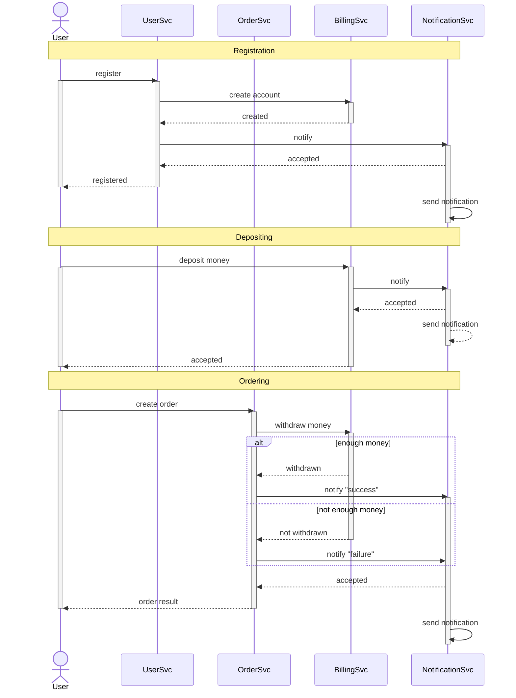

```mermaid
sequenceDiagram
actor User
participant UserSvc
participant OrderSvc
participant BillingSvc
participant NotificationSvc

note over User, NotificationSvc: Registration

User ->> UserSvc: register
activate User
activate UserSvc
UserSvc ->> BillingSvc: create account
activate BillingSvc
BillingSvc -->> UserSvc: created
deactivate BillingSvc
UserSvc ->> NotificationSvc: notify
activate NotificationSvc
NotificationSvc -->> UserSvc: accepted
UserSvc -->> User: registered
deactivate UserSvc
deactivate User
#NotificationSvc ->> NotificationSvc: send email
NotificationSvc ->> NotificationSvc: send notification
deactivate NotificationSvc

note over User, NotificationSvc: Depositing

User ->>+ BillingSvc: deposit money
activate User
BillingSvc ->> NotificationSvc: notify
activate NotificationSvc
NotificationSvc -->> BillingSvc: accepted
NotificationSvc -->> NotificationSvc: send notification
deactivate NotificationSvc
BillingSvc -->>- User: accepted
deactivate User

note over User, NotificationSvc: Ordering

User ->> OrderSvc: create order
activate User
activate OrderSvc
OrderSvc ->> BillingSvc: withdraw money
activate BillingSvc
alt enough money
    BillingSvc -->> OrderSvc: withdrawn
    OrderSvc ->> NotificationSvc: notify "success"
    activate NotificationSvc
else not enough money
    BillingSvc -->> OrderSvc: not withdrawn
    deactivate BillingSvc
    OrderSvc ->> NotificationSvc: notify "failure"
end
NotificationSvc-->>OrderSvc: accepted
OrderSvc -->> User: order result
deactivate OrderSvc
deactivate User
NotificationSvc ->> NotificationSvc: send notification
deactivate NotificationSvc
```