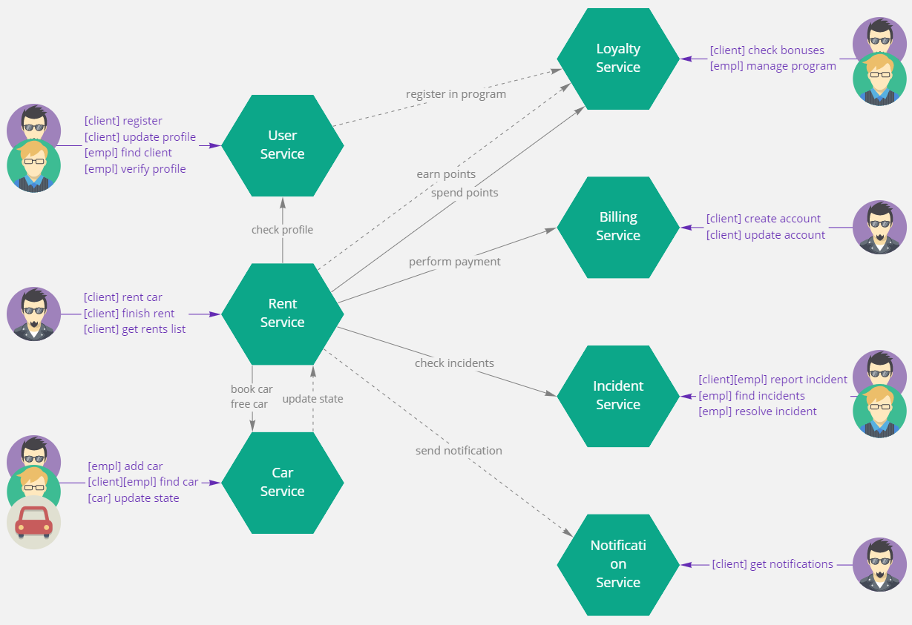
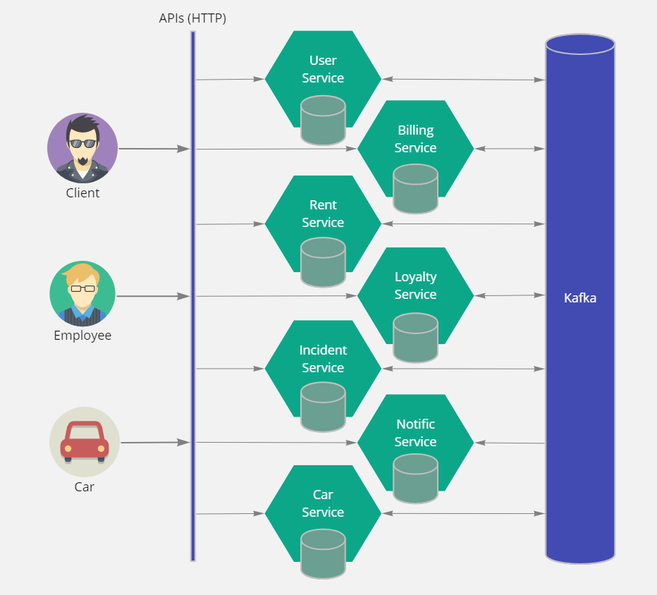

# Services

## Разбиение на сервисы

Систему решено разделить на следующие микро-сервисы:

- User Service
- Billing Service
- Loyalty Service
- Car Service
- Rent Service
- Incident Service
- Notification Service

### User Service

Сервис управления пользователями. Хранит информацию о пользователях и их ролях в системе (клиент или сотрудник). Аутентифицирует пользователей (выдает токен).

Предоставляет API:

- API клиента: регистрация, просмотр и изменения своего профиля
- API сотрудника: регистрации, работа со своим профилем, управление профилями других пользователей

Публикует события:

- Добавлен пользователь
- Обновлен пользователь

Зависимые сервисы:

- Rent Service -- запрашивает у User Service подтвержденность профиля пользователя

### Billing Service

Сервис управления платежными аккаунтами пользователей. Хранит информацию о платежных аккаунтах клиентов. Осуществляет платежи.

Предоставляет API:

- API клиента: управление своими аккаунтами (добавить, удалить, изменить)

Публикует события:

- Добавлен аккаунт
- Обновлен аккаунт
- Совершен платеж

Зависимые сервисы:

- Rent Service -- выставляет счет на оплату, ожидает завершения оплаты

### Loyalty Service

Сервис управления программами лояльности. Хранит информацию о регистрации клиентов в программе лояльности, скидках, накопленных баллах. Осуществляет начисление и списание баллов, предоставляет скидки.

Предоставляет API:

- API клиента: просмотр своих скидок и баллов
- API сотрудника: настройка правил начисления/списания баллов, управление акциями

Публикует события:

- Списаны баллы
- Начислены баллы

Зависимые сервисы:

- Rent Service -- запрашивает у Loyalty Service скидку (списание баллов)

### Car Service

Сервис управления автомобилями. Хранит информацию об автомобилях, как "статическую" (основные атрибуты авто), так и "динамическую" (местоположение, пробег, показания датчиков).

Предоставляет API:

- API клиента: поиск авто
- API сотрудника: управление автомобилями
- API бортового модуля авто: обновление состояния автомобиля

Публикует события:

- Обновлено состояние авто

Зависимые сервисы:

- Rent Service -- бронирует авто у Car Service, освобождает ранее забронированное у Car Service авто

### Incident Service

Сервис управления инцидентами (проишествиями и спорами, требующими разрешения и накладывающие ограничения на последующие аренды). Хранит информацию об открытых и исторических инцидентах.

Предоставляет API:

- API клиента: создать инцидент
- API сотрудника: создать инцидент, завершить инцидент

Зависимые сервисы:

- Rent Service -- запрашивает у Incident Service открытые инциденты

### Rent Service

Основное сервис по аренде автомобилей. Управляет арендой. Хранит информацию об активных и исторических арендах.

Предоставляет API:

- API клиента: арендовать авто, завершить аренду, посмотреть свои аренды
- API сотрудника: посмотреть все аренды

Зависит от сервисов:

- User Service -- запрашивает подтвержденность профиля пользователя
- Billing Service -- проверяет наличие платежного средства, выставлят счет
- Loyalty Service -- запрашивает скидку
- Car Service -- бронирует авто для аренды, освобождает авто после аренды
- Incident Service -- запрашивает открытые инциденты

### Notification Service

Сервис уведомлений. Осуществляет отправку клиенту различных уведомлений. Хранит информацию об исторических уведомлениях.

Предоставляет API:

- API клиента: получить список уведомлений

## Взаимодействие сервисов

### Логическое

### Физическое

Физически сервисы не связаны друг с другом напрямую. Взаимодействие построено на Event Callaboration паттерне через брокер Kafka. Сценарии создания и завершения аренды построены с применением распределенной транзакции (паттерн saga).

