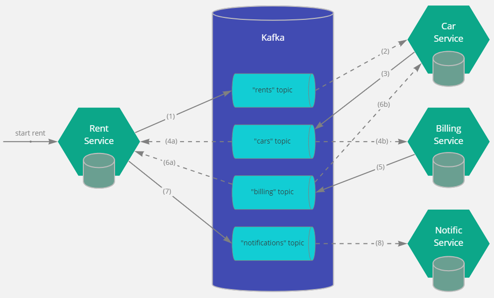

# Распределенные транзакции

## Описание

Распределенные транзакции реализованы для сценариев "начало аренды авто" и "завершение аренды авто" системы оказания услуг каршенринга.

Транзакции реализованы с использованием паттерна "сага" на основе хореографии.

## Сага "начало аренды авто"

Оптимистичный флоу выглядит следующим образом:

- (1) Rent Service создает новую аренду в состоянии Staring и публикует событие RentCreated.
- (2) Car Service потребляет событие RentCreated. Он проверяет наличие автомобиля и его доступность для аренды.
- (3) Car Service резервирует автомобиль и публикует событие CarReserved.
- (4a) Rent Service потребляет событие CarReserved и обновляет состояние объекта аренды.
- (4b) Billing Service потребляет событие CarReserved. Он проверяет счет и положительный баланс на нем.
- (5) Billing Service публикует событие AccountAuthorized.
- (6a) Rent Service потребляет событие AccountAuthorized. Он переводит аренду в состояние Started.
- (7) Rent Service публикует событие для отправки клиенту уведомления о том, что аренда начата.

Пессимистичный флоу при отказе Car Service выглядит следующим образом:

- (1) Rent Service создает новую аренду в состоянии Staring и публикует событие RentCreated.
- (2) Car Service потребляет событие RentCreated. Он проверяет наличие автомобиля и его доступность для аренды.
- (3) Автомобиль недоступен. Car Service публикует событие CarReservationFailed.
- (4a) Rent Service потребляет событие CarReservationFailed и переводит аренду с состояние Error.
- (7) Rent Service публикует событие для отправки клиенту уведомления о том, что аренда не может быть начата.

Пессимистичный флоу при отказе Billing Service выглядит следующим образом:

- (1) Rent Service создает новую аренду в состоянии Staring и публикует событие RentCreated.
- (2) Car Service потребляет событие RentCreated. Он проверяет наличие автомобиля и его доступность для аренды.
- (3) Car Service резервирует автомобиль и публикует событие CarReserved.
- (4a) Rent Service потребляет событие CarReserved и обновляет состояние объекта аренды.
- (4b) Billing Service потребляет событие CarReserved. Он проверяет счет и положительный баланс на нем.
- (5) Проверка счета завершилать неудачей. Billing Service публикует событие AccountAuthorizationFailed.
- (6a) Rent Service потребляет событие AccountAuthorizationFailed. Он переводит аренду в состояние Error.
- (6b) Car Service потребляет событие AccountAuthorizationFailed. Он освобождает зарезервированный автомобиль.
- (7) Rent Service публикует событие для отправки клиенту уведомления о том, что аренда не может быть начата.

## Сага "завершение аренды авто"

